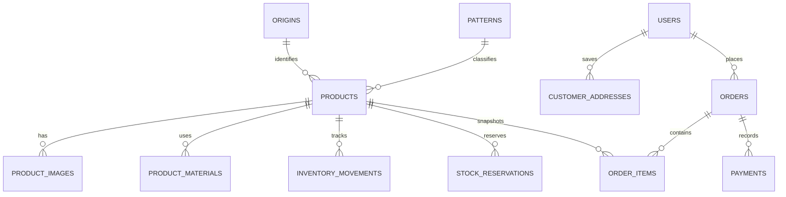

# Inventory and commerce data model

## Decision

Use PostgreSQL already running on the Hosseintalab production server as the
production backend:

- PostgreSQL is the source of truth for inventory, customers, orders, and payments.
- A small server-side Node API will provide customer accounts, sessions, catalog
  administration, checkout, and image uploads.
- Product media is stored on the server and catalogued by `product_images`.
- The browser never receives a database password or connects to PostgreSQL.

The database listens on `127.0.0.1:5432` only. A dedicated application role is
limited to the Hosseintalab database; Nginx will route `/api` to the local API,
not to PostgreSQL.

## Product terminology

| Business term | Database field | Notes |
|---|---|---|
| کد فرش | `products.sku` | Immutable unique product code, for example `HT-ESF-0001` |
| محل بافت | `origins` | Normalized location such as اصفهان, تبریز, کاشان, نائین |
| طرح و نقش | `patterns` | Normalized pattern/design, such as افشان or ماهی |
| ابعاد | `width_cm`, `length_cm`, `diameter_cm` | Store centimetres as numbers; format for the website later |
| سال بافت | `weaving_year_shamsi`, `weaving_year_note_fa` | Stores an exact شمسـی year when known, or a careful note such as «دهه ۱۳۲۰» |
| قیمت | `price_toman` | Integer تومان, never a floating-point amount |
| سن | `age_years` | Estimated current age in years when exact weaving date is not known |
| رنگرزی | `dye_type` | گیاهی, طبیعی, شیمیایی, ترکیبی, یا نامشخص |
| چله | `product_materials.role = warp` | `چله` is the **warp/foundation thread**, not the fringe. ریشه is the exposed end of the warp. |
| پرز | `product_materials.role = pile` | The visible pile material: پشم, ابریشم, کرک, etc. |
| موجودی | `inventory_movements` | Calculated from an auditable movement ledger; never overwritten manually |

`کرک` is recorded as `kork_wool` (fine, soft wool—often lamb's wool) rather
than being translated ambiguously as silk or cotton.

## Age classification

The database calculates this from `age_years` so the category cannot drift from
the number shown to customers:

| Age | Database value | Customer-facing label |
|---|---|---|
| Under 20 years | `contemporary` | معاصر |
| 20–49 years | `old` | قدیمی |
| 50–99 years | `semi_antique` | نیمه‌آنتیک |
| 100 years or more | `antique` | آنتیک |
| Unknown | `unknown` | نیازمند کارشناسی |

The 50th and 100th anniversaries begin the next category. A specialist can
still add condition, restoration, age-confidence, and provenance notes.

## Core records

### Inventory integrity

- A carpet is not deleted when sold; it is marked `sold` or `archived`.
- Every received, sold, returned, damaged, or adjusted quantity is an immutable
  inventory movement.
- A short-lived checkout reservation is kept separately from physical stock, so
  a paid order subtracts stock exactly once rather than being deducted once at
  reservation and again at sale.
- An antique one-of-one rug starts with one `received` movement. The stock
  balance is then always explainable.
- Order items snapshot SKU, title, dimension, and price at the time of order;
  future catalog edits do not rewrite historic purchases.

### Public, customer, and staff access

- Guests can retrieve only active, public product data through read-only API
  endpoints.
- Customers can retrieve and edit only their own profile, addresses, and orders
  through a signed, secure server session.
- Customers cannot alter prices, inventory, payments, or order status because
  PostgreSQL is never exposed to the browser.
- Staff and admins use authenticated API routes to manage catalog entries and
  stock movements; all important changes are written to `audit_events`.
- Checkout is a database transaction in the API, where quantity is checked and
  a time-limited reservation is created atomically before payment begins.

## Setup sequence

1. Create the private `hosseintalab` database and its local API role on the
   existing server.
2. Apply `database/migrations/001_initial_commerce.sql` as the PostgreSQL
   administrator.
3. Create the first administrator through the API bootstrap command; passwords
   are hashed in the API before they reach the database.
4. Keep the API database URL and session secret in a root-owned server
   environment file—never in `.env`, JavaScript, Git, or the browser.
5. Build the private catalog-admin interface, product import flow, customer
   login, cart, checkout transaction, and Iranian payment gateway integration
   in that order.

## Not in scope yet

- Payment-gateway selection and settlement logic
- Tax and invoice rules
- Delivery-rate calculation
- Customer-facing checkout screens
- Staff catalog administration interface

The schema intentionally supports those features without exposing unfinished
commerce controls in the current storefront.
