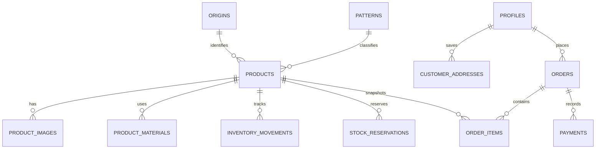

# Inventory and commerce data model

## Decision

Use a managed Supabase project as the production backend:

- PostgreSQL is the source of truth for inventory, customers, orders, and payments.
- Supabase Auth provides customer accounts and sessions.
- Supabase Storage holds product photography behind staff-only upload rules.
- Row Level Security protects customer data and prevents the browser from
  changing prices, stock, or order state.

The current Ubuntu host has 1 GB of RAM and already runs other applications.
Do not self-host the complete Supabase stack there. The official minimum for a
complete self-hosted Supabase installation is 4 GB RAM; managed Supabase keeps
the commerce database independent from the storefront host.

## Product terminology

| Business term | Database field | Notes |
|---|---|---|
| کد فرش | `products.sku` | Immutable unique product code, for example `HT-ESF-0001` |
| محل بافت | `origins` | Normalized location such as اصفهان, تبریز, کاشان, نائین |
| طرح و نقش | `patterns` | Normalized pattern/design, such as افشان or ماهی |
| ابعاد | `width_cm`, `length_cm`, `diameter_cm` | Store centimetres as numbers; format for the website later |
| سال بافت | `weaving_year_shamsi`, `weaving_year_note_fa` | Stores an exact شمسـی year when known, or a careful note such as «دهه ۱۳۲۰» |
| قیمت | `price_toman` | Integer تومان, never a floating-point amount |
| سن | `age_years` | Estimated current age in years when exact weaving date is not known |
| رنگرزی | `dye_type` | گیاهی, طبیعی, شیمیایی, ترکیبی, یا نامشخص |
| چله | `product_materials.role = warp` | `چله` is the **warp/foundation thread**, not the fringe. ریشه is the exposed end of the warp. |
| پرز | `product_materials.role = pile` | The visible pile material: پشم, ابریشم, کرک, etc. |
| موجودی | `inventory_movements` | Calculated from an auditable movement ledger; never overwritten manually |

`کرک` is recorded as `kork_wool` (fine, soft wool—often lamb's wool) rather
than being translated ambiguously as silk or cotton.

## Age classification

The database calculates this from `age_years` so the category cannot drift from
the number shown to customers:

| Age | Database value | Customer-facing label |
|---|---|---|
| Under 20 years | `contemporary` | معاصر |
| 20–49 years | `old` | قدیمی |
| 50–99 years | `semi_antique` | نیمه‌آنتیک |
| 100 years or more | `antique` | آنتیک |
| Unknown | `unknown` | نیازمند کارشناسی |

The 50th and 100th anniversaries begin the next category. A specialist can
still add condition, restoration, age-confidence, and provenance notes.

## Core records

### Inventory integrity

- A carpet is not deleted when sold; it is marked `sold` or `archived`.
- Every received, sold, returned, damaged, or adjusted quantity is an immutable
  inventory movement.
- A short-lived checkout reservation is kept separately from physical stock, so
  a paid order subtracts stock exactly once rather than being deducted once at
  reservation and again at sale.
- An antique one-of-one rug starts with one `received` movement. The stock
  balance is then always explainable.
- Order items snapshot SKU, title, dimension, and price at the time of order;
  future catalog edits do not rewrite historic purchases.

### Public, customer, and staff access

- Guests can read only active, public product data and public product images.
- Customers can read and edit only their own profile, addresses, and orders.
- Customers cannot alter prices, inventory, payments, or order status from the
  browser.
- Staff and admins manage catalog entries and stock movements.
- Checkout will be a server-side function, where quantity is checked and a
  time-limited reservation is created atomically before payment begins.

## Setup sequence

1. Create a managed Supabase project for Hosseintalab.
2. Apply `supabase/migrations/20260731_0001_inventory_and_commerce.sql` in the
   Supabase SQL editor or through the Supabase CLI.
3. Create the first staff user using Auth, then promote that profile to `admin`
   with the SQL shown at the bottom of the migration.
4. Add the project URL and public anonymous key to a local `.env` file; never
   commit service-role keys.
5. Build the private catalog-admin interface, product import flow, customer
   login, cart, checkout function, and Iranian payment gateway integration in
   that order.

## Not in scope yet

- Payment-gateway selection and settlement logic
- Tax and invoice rules
- Delivery-rate calculation
- Customer-facing checkout screens
- Staff catalog administration interface

The schema intentionally supports those features without exposing unfinished
commerce controls in the current storefront.
